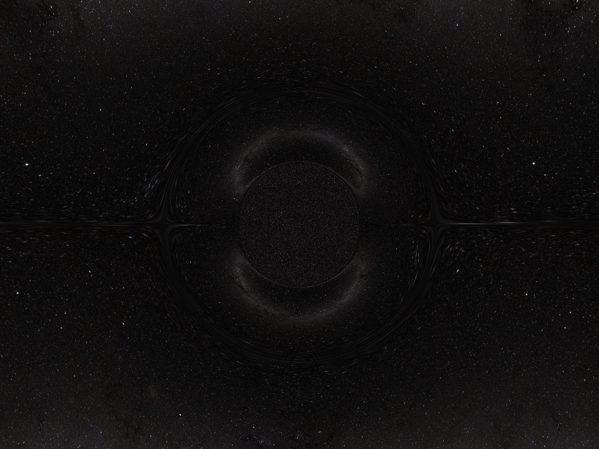
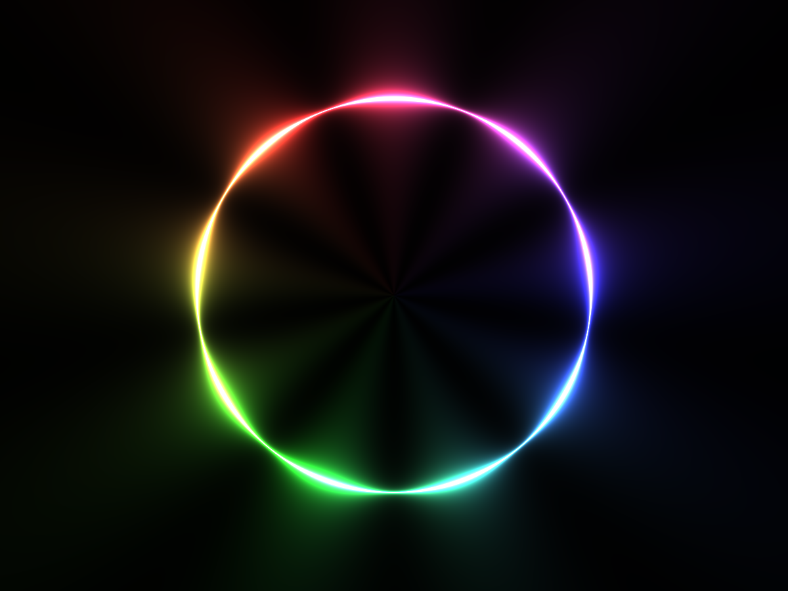
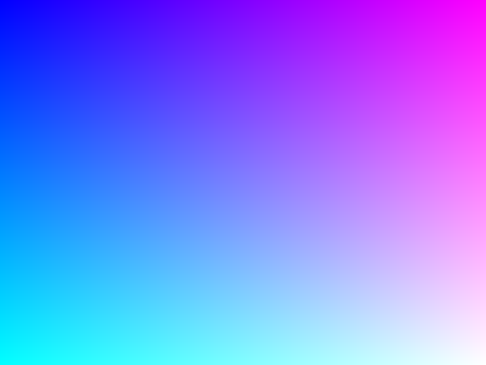
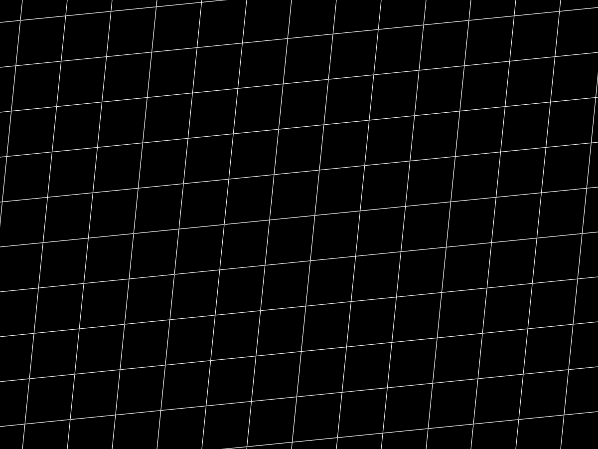
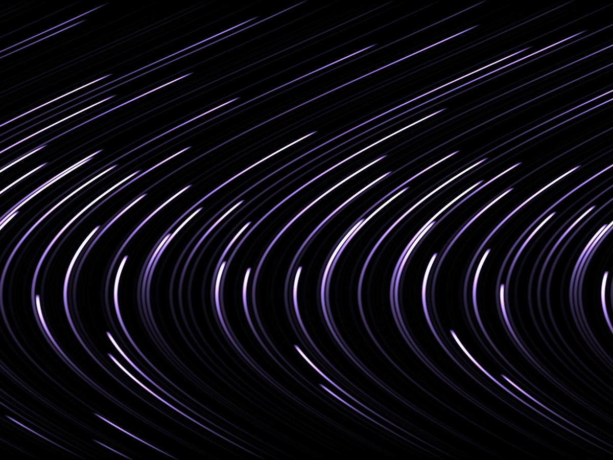
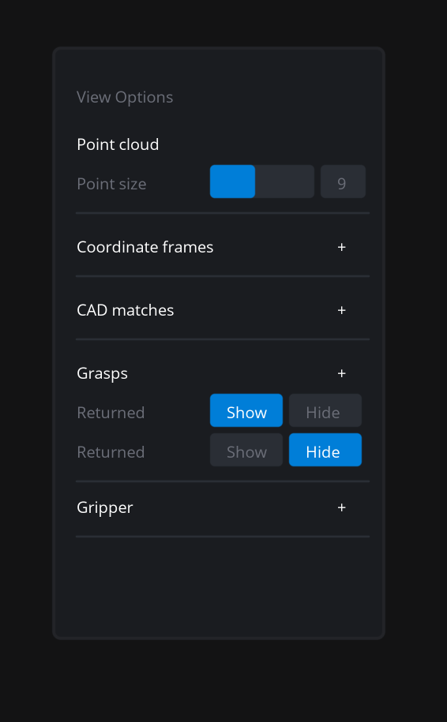

# Elara GFX

> :warning: **IMPORTANT:** Project Elara has switched over to the open-source forge [Codeberg](https://codeberg.org/). The Project Elara repositories have been moved to [this Codeberg page](https://codeberg.org/elaraproject/). **This GitHub repository is no longer maintained**.

---

A GPU programming library for Project Elara, focused on functionality and speed, with support for:

- A medium-high-level OpenGL wrapper covering essential OpenGL functionality while writing less code
  - Two APIs are available: a high-level drawing API (see point below), and a medium-level API in the spirit of [TWGL](https://twgljs.org/) that maps more directly to OpenGL for fine-grained control _without_ needing to write a bunch of boilerplate
- A basic drawing API with support for most graphics primitives, including images, text, rectangles, lines, quads, parametric curves, and circles, with the ability to pass vertex arrays for more complex shapes
  - Many primitives use [signed distance fields (SDFs)](https://iquilezles.org/articles/distfunctions/) for high-quality resolution-independent rendering
- A minimalist sandbox for running fragment shaders locally, inspired by the [Book of Shaders editor](http://editor.thebookofshaders.com/)
- [Experimental support](examples/ui_rendering.rs) for use as a UI rendering backend

Design goals for the library include:

- (Relatively) few dependencies and fast initial compile times
- User-friendliness without sacrificing control or functionality, with lots of examples and sane API conventions
- 100% free and open-source software, dedicated to the public domain, so you can use it however you want!

**Note:** Elara GFX is developed concurrently with [NanoGL](https://github.com/Songtech-0912/nanogl). Unlike its sister library, Elara GFX _does not_ aim to be lightweight or zero-dependency, and will not be backwards-compatible until the release of 1.0.

**Shoutouts:** See [Acknowledgements](./ACKNOWLEDGEMENTS.md)

## Demos

These demos use a variety of fragment shaders from Shadertoy as well as custom-created shaders, and all use only the library's functionality. Note that by default the library renders to `.ppm` images, these can be converted to PNGs with ImageMagick.

| Demo | Preview |
|-----|------|
| [Physically-accurate black hole](examples/black_hole.rs) |  |
| [Glowing circles shader (adapted from Shadertoy)](examples/shaders/circle.frag) |  |
| [Basic gradient shader](examples/shaders/gradient.frag) |  |
| [Grid shader](examples/shaders/grid.frag) |  |
| [Orbiting particles shader (adapted from GLSL Sandbox)](examples/shaders/orbits.frag) |  |
| [Basic GPU-accelerated UI rendering](examples/ui_rendering.rs) |  |

### OpenGL fragment shader sandbox

Elara GFX also offers a basic example of an OpenGL shader sandbox to natively run GLSL fragment shaders straight from the commandline, much like [GLSL Sandbox](https://glslsandbox.com/), [Shadertoy](https://www.shadertoy.com/), and [the Book of Shaders editor](http://editor.thebookofshaders.com/). The source code is in [fragshader.rs](examples/fragshader.rs). To use it, simply run:

```bash
cargo run --example fragshader -- /path/to/yourshader.frag
# for instance, to run the orbiting particles example
cargo run --example fragshader -- examples/shaders/orbits.frag
```

> **Note:** Currently, this sandbox supports **fragment shaders only**. You can, however, load vertex shaders by directly using the library API. The path to the shader must also be **relative to** the root of the repository (the root being the folder your `Cargo.toml` is located at).

## Install

Make sure to clone the repository and grab submodules:

```
git clone --recursive https://github.com/elaraproject/elara-gfx.git
```

On macOS and Windows (untested), Elara GFX should compile without any need to download additional libraries. On many Linux distributions, this is also the case, but if Elara GFX does not compile out of the box, follow these instructions.

### Debian-based Linux

```sh
sudo apt install xorg-dev mesa-utils libglu1-mesa-dev freeglut3-dev mesa-common-dev
```

## Limitations

- We do not natively support mesh-loading and other 3D OpenGL functionalities (such as PBR or raymarching). You will need to implement this yourself.
- We do not offer a complete UI library
